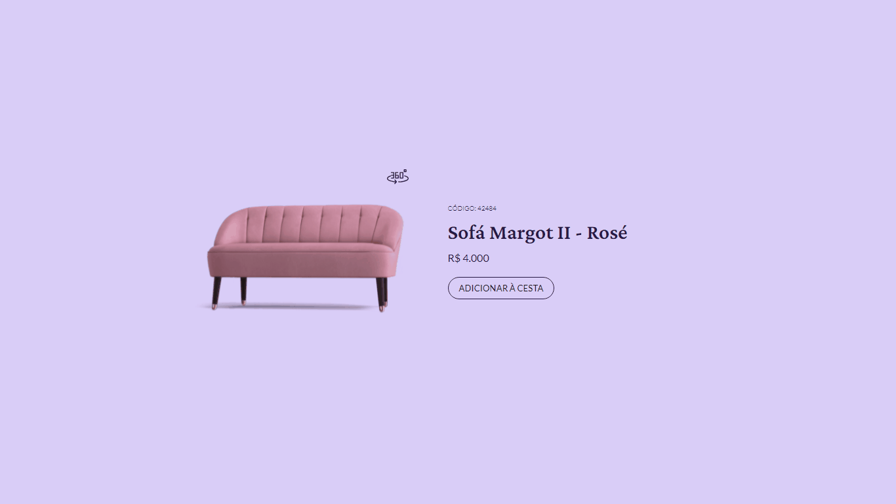

<h1 align="center"> ProductCard - Desafio Rocketseat </h1>

  <a href="#tecnologias-">Tecnologias</a>&nbsp;&nbsp;&nbsp;|&nbsp;&nbsp;&nbsp;
  <a href="#sobre-">Sobre</a>

 
  Card de uma tela de um produto de sofá, com a visualização 3d e algumas informações

  

Link para o [servidor hospedado](https://productcardd.netlify.app/)
Design do [Figma](https://www.figma.com/file/A30v90xDwaqedWEOsWHJeU/Card-de-Produto-%E2%80%A2-Desafio-02-(Community)?node-id=103%3A153&mode=dev)

## Tecnologias 👨‍💻 
Esse projeto foi desenvolvido com as seguintes tecnologias:
- Vue 3
- Typescript
- CSS
- Vite
- Figma

## Sobre 📖

### Descrição
Este projeto é o desafio 02 do #boraCodar da Rocketseat, onde a proposta era desenvolver o card que mostra as informações de um sofá, com uma visualização 3d

### Objetivo
Praticar alguns conceitos aprendidos. Entre eles:

- Consumir um design do Figma
- Criar um projeto utilizando Vue, Typescript e Vite

by [William Bierhals](https://github.com/will1Zera)